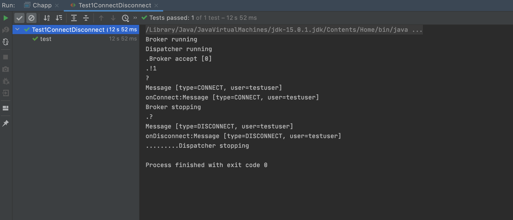

## DAT110 - Project 2: Publish-subscribe messaging middleware

### Organisation

Aahed Diyab - 588408

Olav Pete - 588249

### Screenshots of running project

Broker:


Getting ChApp to work with IntelliJ:
```
module project_2 {
    requires javafx.graphics;
    requires javafx.controls;
    requires javafx.fxml;
    requires gson;
    requires java.sql;

    opens no.hvl.dat110.chapp;
    opens no.hvl.dat110.messages;
}
```

Olav's ChApp:

Aahed's ChApp:


### Screenshots of running tests

TestStorage:

Test1ConnectDisconnect:

Test2Reconnect:

Test3MultipleConnections:

Test4CreateDelete:

Test5Subscribe:

Test6Publish:

Test7MultiPublish:


